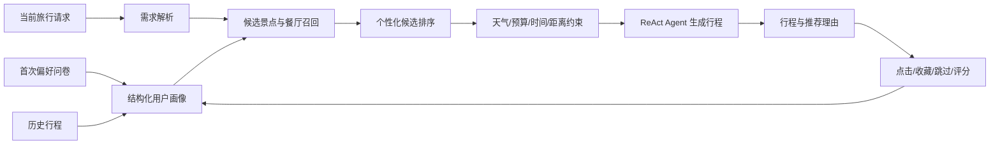

# 个性化旅游规划系统建设方案

## 1. 文档目的

本文档用于指导 AI 旅游规划系统从“基于用户输入和历史摘要的 Prompt 个性化”升级为具备数据闭环、个性化排序、约束规划、可解释推荐和效果评估能力的个性化旅游规划系统。

目标是使系统不仅能够生成行程，还能够回答以下问题：

- 系统如何理解用户的长期偏好？
- 推荐某个景点的依据是什么？
- 用户的负反馈是否会影响后续推荐？
- 如何证明系统确实比非个性化方法更适合用户？

## 2. 当前系统分析

### 2.1 已有能力

当前系统已经具备较完整的工程基础：

- 基于 ReAct 的 `THINK -> ACT -> OBSERVE -> FINAL` 智能体循环；
- Bing 搜索、高德 POI、天气服务和本地攻略 RAG 多源数据采集；
- BM25、向量检索和 RRF 融合；
- Chroma 向量库及内存检索降级机制；
- 行程结构化生成、JSON 容错和行程结果校验；
- Agent 推理轨迹展示；
- JWT 登录和用户数据隔离；
- 历史行程保存与查询；
- `UserProfileService` 基于历史行程构建用户记忆，并注入行程生成 Prompt。

### 2.2 当前个性化能力边界

当前实现主要流程为：

```text
用户手动填写偏好
    -> 保存历史行程
    -> 从最近历史行程统计节奏、住宿、饮食和预算
    -> 构建画像文本
    -> 注入生成 Prompt
```

这已经属于初步的长期记忆个性化，但仍存在以下不足：

1. 用户偏好主要依赖手动选择，首次使用时缺少长期画像；
2. 画像依赖生成后的行程文本反推，粒度较粗；
3. 缺少收藏、跳过、不感兴趣、评分等正负反馈；
4. 缺少独立的个性化候选排序层；
5. 缺少画像权重、来源和置信度；
6. 缺少推荐原因和过滤原因的记录；
7. 缺少与非个性化方法的对照实验和量化指标。

因此，后续工作重点不应只是继续增加 Prompt，而应形成完整闭环：

```text
数据采集 -> 用户画像 -> 候选召回 -> 个性化排序 -> 约束规划
    -> Agent 生成 -> 推荐解释 -> 用户反馈 -> 画像更新
```

## 3. 总体目标架构



### 3.1 模块职责

| 模块 | 主要职责 |
|---|---|
| 用户画像模块 | 管理显式偏好、隐式偏好、偏好权重和置信度 |
| 行为反馈模块 | 记录用户浏览、收藏、跳过、替换、评分等行为 |
| 候选召回模块 | 从高德、RAG、本地攻略和搜索结果中召回候选项 |
| 个性化排序模块 | 根据用户画像和当前请求计算候选项得分 |
| 约束规划模块 | 处理预算、天气、距离、营业时间和饮食禁忌 |
| ReAct Agent | 理解需求、调用工具、汇总信息并生成结构化行程 |
| 推荐解释模块 | 说明推荐依据、过滤原因和用户偏好匹配情况 |
| 实验评估模块 | 统计偏好命中率、负反馈率、约束满足率和满意度 |

## 4. 个性化用户画像设计

### 4.1 显式偏好

首次使用时增加轻量偏好问卷，使用户在没有历史数据时也能获得个性化结果。

建议采集旅行风格（自然风景、历史文化、美食探索、城市漫游、拍照打卡、亲子活动、夜生活、购物、户外运动）、旅行节奏（轻松、适中、紧凑）、行为约束（不早起、少换酒店、少走路、优先公共交通、避开人多景点、适合老人或儿童）、消费与住宿以及饮食偏好。

### 4.2 结构化画像字段

建议新增 `user_profile` 和 `user_preference` 数据表。

#### `user_profile`

```text
user_id
travel_style
pace_preference
hotel_preference
budget_preference
walking_tolerance
early_rising_tolerance
crowd_tolerance
food_preferences
dietary_restrictions
preferred_spot_types
avoided_spot_types
profile_version
updated_at
```

#### `user_preference`

```text
id
user_id
preference_type
preference_value
weight
confidence
source
last_observed_at
```

偏好记录示例：

```json
{
  "tag": "历史文化",
  "weight": 0.86,
  "source": "用户主动选择",
  "confidence": 0.95,
  "updated_at": "2026-09-03"
}
```

### 4.3 偏好来源和置信度

| 来源 | 示例 | 建议可信度 |
|---|---|---:|
| 用户主动选择 | 用户问卷选择“美食” | 最高 |
| 明确反馈 | 用户收藏历史文化景点 | 高 |
| 重复行为 | 多次点击餐厅或古镇 | 中高 |
| 历史行程推断 | 多次安排博物馆 | 中等 |
| LLM 推断 | 从自然语言描述猜测偏好 | 较低 |

## 5. 用户行为与反馈闭环

### 5.1 前端交互

在行程结果页为景点和餐厅增加收藏、不感兴趣、替换、重新生成当天行程、行程整体评分、“符合我的偏好”和“不符合我的偏好”等操作。

支持局部重规划：只重新生成某一天、替换某个景点、减少步行、降低预算、增加美食、增加拍照地点或安排日落活动。

### 5.2 行为数据表

建议新增 `user_behavior` 表：

```text
id
user_id
trip_id
item_type
item_id
item_name
action_type
context_json
created_at
```

行为类型可以包括：

```text
VIEW
CLICK
SAVE
DISLIKE
REPLACE
REGENERATE
RATE
```

### 5.3 画像更新规则

建议采用可解释的增量更新方式：

```text
用户主动选择某标签：weight + 0.30
收藏相关项目：weight + 0.15
点击相关项目：weight + 0.05
明确不感兴趣：weight - 0.30
替换相关项目：weight - 0.20
长期未使用：weight 按时间衰减
```

权重限制在 `[0, 1]` 范围内，并根据来源设置不同置信度。

## 6. 个性化候选排序

### 6.1 推荐流程

```text
检索候选 -> 计算个性化分数 -> 过滤硬约束 -> Agent 规划
```

### 6.2 综合评分模型

对景点、餐厅等候选项计算综合分数：

$$
Score(u,i)=
w_p P(u,i)+
w_b B(u,i)+
w_c C(u,i)+
w_r R(u,i)+
w_n N(u,i)
-w_d D(u,i)
-w_x X(u,i)
$$

其中 $P(u,i)$ 是偏好匹配度，$B(u,i)$ 是历史行为相似度，$C(u,i)$ 是当前上下文匹配度，$R(u,i)$ 是真实数据可信度，$N(u,i)$ 是新颖性，$D(u,i)$ 是距离和时间成本，$X(u,i)$ 是用户明确排斥项惩罚。

### 6.3 硬约束和软偏好

硬约束违反后不能安排，包括预算、恶劣天气、饮食禁忌、明确排斥活动、营业时间和交通时长约束。

软偏好违反后只降低排序得分，包括美食、拍照、慢节奏、历史文化和性价比偏好。

例如：用户喜欢历史文化时，博物馆、古镇和历史街区加分；用户不喜欢爬山时，山地景点降权或过滤；用户不喜欢早起时，早上 8 点前开始的活动过滤；用户少辣时，高辣餐厅过滤或降权。

## 7. 新颖性和长期记忆

长期画像至少维护用户去过的城市和景点、喜欢和不喜欢的景点类型、常接受预算范围、可接受步行距离、偏好活动时段、餐饮类型、最近一次反馈、画像更新时间和版本。

生成行程时同时考虑偏好和新颖性。例如，用户去过宽窄巷子后，不再简单重复推荐，而是推荐杜甫草堂、金沙遗址等同类但未体验过的景点。

结果页可以展示“根据你之前收藏过的历史文化类景点”“你曾多次选择轻松节奏，本次减少早起和连续奔波”“根据你的少辣偏好，已过滤高辣餐厅”等依据。

## 8. 推荐日志与可解释性

建议新增 `recommendation_log` 表：

```text
id
user_id
trip_id
item_name
item_type
preference_score
behavior_score
novelty_score
distance_penalty
final_score
explanation
created_at
```

该表用于追溯某个推荐结果的生成依据，例如：

```text
推荐：杜甫草堂
偏好匹配：0.90
历史行为匹配：0.72
新颖性：1.00
交通惩罚：0.10
最终得分：0.84
推荐理由：符合用户历史文化偏好，用户尚未体验过，且距离当天上一站较近。
```

## 9. 后端模块建议

```text
service/
├── UserProfileService.java
├── PreferenceInferenceService.java
├── BehaviorFeedbackService.java
├── CandidateRecallService.java
├── PersonalizedRankingService.java
├── ConstraintPlanningService.java
└── RecommendationExplanationService.java
```

`PreferenceInferenceService` 负责根据问卷、历史行程和行为数据推断偏好权重及置信度；`CandidateRecallService` 负责统一封装高德 POI、RAG 和搜索结果；`PersonalizedRankingService` 负责计算候选项得分；`ConstraintPlanningService` 负责硬约束；`RecommendationExplanationService` 负责推荐理由和过滤理由。

ReAct Agent 继续负责需求理解、工具调用、真实数据汇总、结构化行程生成和轨迹输出。个性化排序和硬约束不应完全交给大模型，而应由确定性业务模块控制。

## 10. 前端功能规划

### 10.1 首页

在现有偏好设置基础上增加“我的旅行偏好”、首次使用偏好问卷、偏好标签管理、删除某项记忆以及查看系统如何理解用户。

### 10.2 结果页

每个景点和餐厅增加个性化标签、推荐理由、收藏、不感兴趣、替换和重新生成当天行程等操作。

### 10.3 个性化依据展示

建议展示：

```text
本次规划结合了：
- 你的历史文化偏好
- 你常选择的轻松节奏
- 你对少辣饮食的要求
- 你过去未体验过的景点
- 本次旅行的天气、预算和交通约束
```

## 11. 实验设计

### 11.1 对照组

#### Baseline A：无个性化

只根据目的地、日期和预算生成行程。

#### Baseline B：Prompt 画像

使用当前历史行程画像文本，并将其注入 Prompt。

#### Method C：完整个性化方法

使用结构化用户画像、用户行为反馈、个性化候选排序、硬约束过滤、新颖性控制、推荐解释和反馈驱动的画像更新。

### 11.2 评价指标

#### 偏好命中率

$$
PreferenceHitRate=
\frac{\text{符合用户偏好的推荐数量}}
{\text{推荐总数量}}
$$

#### 负反馈率

$$
DislikeRate=
\frac{\text{用户标记不喜欢的推荐数量}}
{\text{推荐总数量}}
$$

#### 约束满足率

$$
ConstraintRate=
\frac{\text{满足预算、天气、忌口等约束的行程数量}}
{\text{行程总数量}}
$$

同时统计重复推荐率、用户 1 到 5 分满意度以及推荐理由的解释接受度。

### 11.3 实验记录表

| 方法 | 偏好命中率 | 负反馈率 | 约束满足率 | 重复推荐率 | 满意度 |
|---|---:|---:|---:|---:|---:|
| 无个性化 | 待测 | 待测 | 待测 | 待测 | 待测 |
| Prompt 画像 | 待测 | 待测 | 待测 | 待测 | 待测 |
| 完整个性化方法 | 待测 | 待测 | 待测 | 待测 | 待测 |

实验应保证测试用户画像明确、各方法使用相同的目的地和旅行约束，并记录样本量和实验局限性。

## 12. 分阶段实施计划

### 阶段一：结构化画像

- 增加偏好问卷；
- 增加 `user_profile` 和 `user_preference`；
- 将画像从文本升级为结构化对象；
- 将画像注入生成流程；
- 增加画像查看和修改页面。

### 阶段二：行为反馈

- 增加收藏、不感兴趣、替换景点和行程评分；
- 增加 `user_behavior`；
- 实现基础画像增量更新。

### 阶段三：个性化排序

- 统一候选景点和餐厅数据模型；
- 增加偏好匹配分、历史行为分、新颖性分；
- 增加距离和预算惩罚；
- 增加硬约束过滤；
- 将排序结果注入 Agent。

### 阶段四：解释与实验

- 增加推荐理由和过滤理由；
- 增加推荐日志；
- 实现指标统计；
- 完成三组对照实验；
- 准备答辩演示数据和实验结论。

## 13. 建议的毕设创新点表述

### 创新点一：多源用户画像融合

融合用户显式偏好、历史行程、点击收藏和负反馈等信息，构建带权重和置信度的长期用户画像。

### 创新点二：个性化排序与约束规划结合

将用户偏好匹配、行为相似度、新颖性、距离成本和真实数据可信度纳入候选评分，并结合天气、预算、时间和饮食约束完成行程规划。

### 创新点三：可解释、可追溯的个性化推荐

记录每次推荐的画像依据、候选得分、过滤原因和推荐理由，使系统能够解释“为什么推荐”和“为什么不推荐”。

## 14. 答辩时的核心表述

本系统的个性化不是简单地将用户偏好拼接到大模型 Prompt 中，而是建立了一个由用户数据驱动的个性化规划闭环：

```text
显式偏好与行为反馈采集
    -> 带权重和置信度的用户画像
    -> 多源候选召回
    -> 个性化排序
    -> 硬约束过滤
    -> ReAct Agent 生成行程
    -> 推荐理由和过滤原因解释
    -> 用户反馈更新画像
```

大模型负责需求理解、工具调用和行程表达；个性化排序、硬约束和数据追踪由确定性模块完成。这样可以兼顾生成能力、推荐质量、系统可解释性和实验可验证性。

## 15. 最小可行实现范围

如果开发时间有限，优先完成：

1. 结构化用户偏好表；
2. 用户收藏和不感兴趣反馈；
3. 基于标签的候选景点评分；
4. 去重和新颖性控制；
5. 推荐理由展示；
6. 推荐日志保存；
7. 与当前 Prompt 画像方法的对照实验。

这七项足以将系统从“有历史记忆的 AI 行程生成器”提升为“具备可解释个性化推荐闭环的旅游规划系统”。
